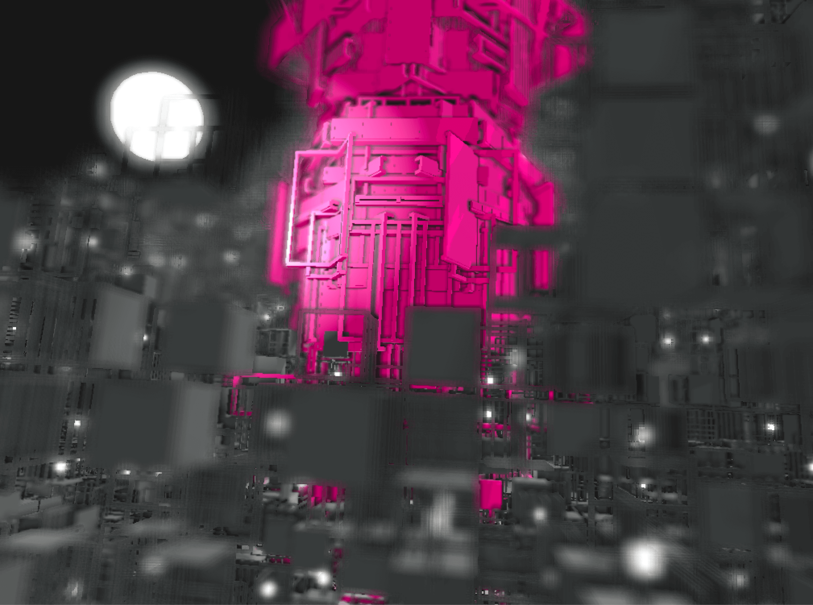

# ofxDeferredShading


## Concept
### Modern OpenGL compatible
I was satidfied with [ofxPostPrpcessing](https://github.com/neilmendoza/ofxPostProcessing) long time, which is fabulous and has so many beautiful vfx in it. I really appreciate the author and contributors.
But there is little problem when I use my own shader with it. It is not written in "modern" shader version so cannot coexist with like OpenGL 3.2 & GLSL 410.
At this moment, it also means I abandoned legacy but helpful functions including ofLight, glBegin()-glEnd()...
### Photo-realistic in Real-time
And the addon mentioned above has only few effects for photo-real purpose such like "cast shadow". So I decided to reproduce and regather PostProcesses focusing "photo-real" rendering and compatible in modern version.

## Usage
* copy the ```shader/``` directory to your ```bin/```
* setting OpenGL version in main.cpp
```
int main( ){
    ofGLWindowSettings settings;
    settings.setGLVersion(3, 2); // now we use OpenGL 3.2
    settings.width = 1024;
    settings.height = 768;

    ofCreateWindow(settings);
    ofRunApp(new ofApp());
}
```
* declare instances in ofApp.h
```C++
// declare in ofApp.h
ofxDeferredProcessing deferred;
ofxDeferredShading::SsaoPass* vfx1;
ofxDeferredShading::PointLightPass* vfx2;
ofxDeferredShading::ShadowLightPass* vfx3;
ofxDeferredShading::HdrBloomPass* vfx4;
...
```
* init and create Passes in ofApp::setup(), and get reference of Passes
```C++
deferred.init(ofGetWidth(), ofGetHeight());
vfx1 = deferred.createPass<ofxDeferredShading::SsaoPass>().get();
vfx2 = deferred.createPass<ofxDeferredShading::ShadowLightPass>().get();
vfx3 = deferred.createPass<ofxDeferredShading::PointLightPass>().get();    
vfx4 = deferred.createPass<ofxDeferredShading::HdrBloomPass>().get();
```
* set parameters via reference
```C++
vfx1->setOcculusionRadius(5.0);
vfx1->setDarkness(1.0);
```
* draw objects between begin() and end().
* If you want to HDR color, just specify vertex color more than 1.0 in ofFloatColor's parameters.
* if you want to use cast shadow (ShadowLightPass), you need another draw-objects call.
```
// for shadow map
shadowLightPass->beginShadowMap();
    drawObjs(); // draw something
    lightPass->drawLights(); // draw light bulbs
shadowLightPass->endShadowMap();

// for rendering pass
deferred.begin(cam);
    drawObjs(); // exactly the same call above
    lightPass->drawLights();
deferred.end();
```
## Reference
### Render Pass
* Basic architecture and "RenderPass" is quoted from https://github.com/neilmendoza/ofxPostProcessing .
* “GBuffer” specification is from https://github.com/hanasaan/ofxDeferredProcessing/tree/master/src .

### Effects
Ambient Occlusion
* easy algorithm based on https://learnopengl.com/#!Advanced-Lighting/SSAO

Point light with attenuation
* https://github.com/jacres/of-DeferredRendering

Casting shadow light (Shadow Map)
* tiny implementation of "shadow map" (not exponential, not blurred)
* https://github.com/jacres/of-ESMShadowMapping

High Dynamic Range + Bloom
* https://learnopengl.com/#!Advanced-Lighting/Bloom

Defocus Blur
* http://pasteall.org/10779

## Author
[Ayumu Nagamatsu](http://ayumu-nagamatsu.com/)
